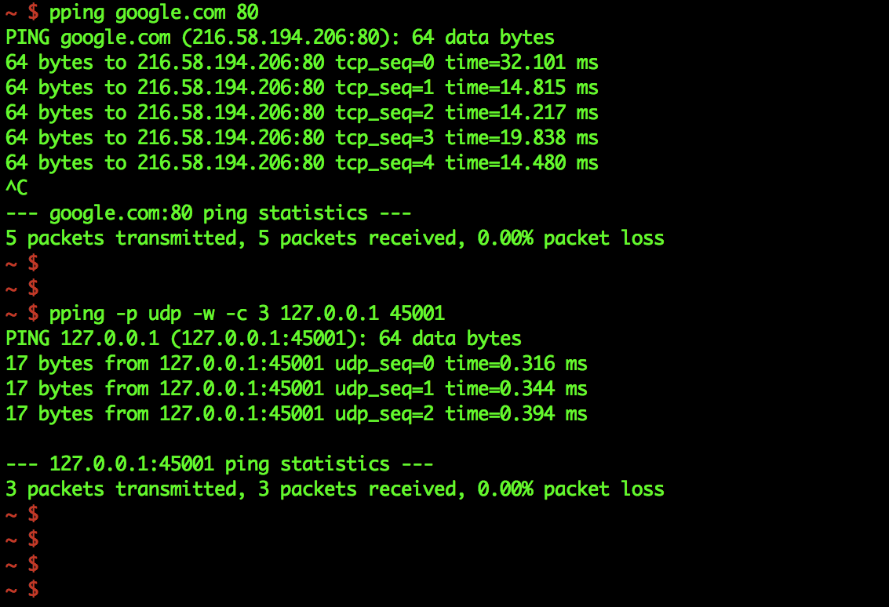

pping - TCP and UDP Pinger
==========================

pping (Protocol Ping) is a command line utility that can simulate ICMP-like pings for the TCP and UDP protocols.

_Supported OSes:_ macOS, Linux, Android (arm) and Windows. pping can be built for any other OS or architecture quite easily by using Go's GOOS and GOARCH parameters.

Installation
------------
Download the latest release for your operating system from the [releases page](https://github.com/codeliveroil/pping/releases), unzip and run `install.sh` or run the binary (`pping`) directly.

Usage
-----
```
pping -help
```

**Examples:**
```
pping myserver.com 55004
pping -p udp -w 192.168.1.9 40001
pping -d 8.8.8.8 example.com 8080
```


Screenshot
----------



Demo
----


Library API for GO
------------------

```golang
import "github.com/codeliveroil/pping/pinger"

...

p := pinger.Pinger{
	Host:        "google.com",
	Port:        80,
	Protocol:    "tcp",
	Wait:        false,
	PayloadSize: 64,
	Interval:    1 * time.Second,
	TTL:         10 * time.Second,
	MaxPings:    5,
	DNSServer:   "",
	Log:         func(msg string) { fmt.Println(msg) },
}

res := &pinger.Result{}
err := p.Ping(res)
if err != nil {
	// handle error
}

fmt.Printf("Received=%d, Dropped=%d, Total=%d\n", res.Received, res.Dropped, res.Received+res.Dropped)
```

Compile from source
-------------------

```
go get github.com/codeliveroil/pping
make
```
